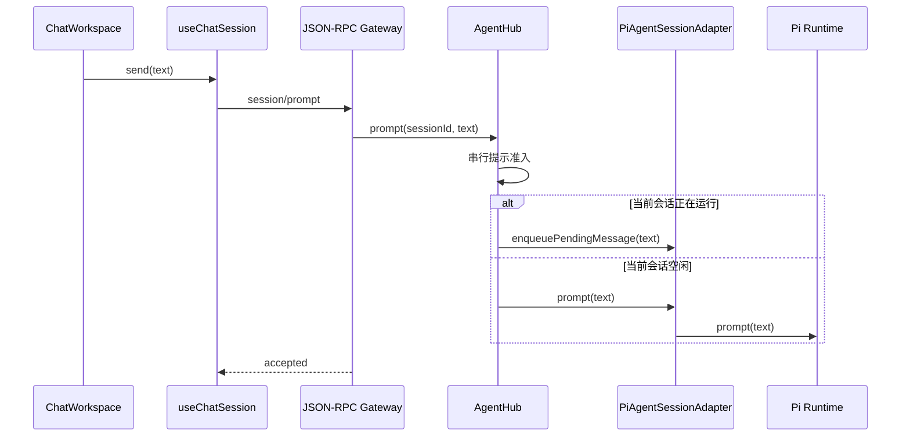
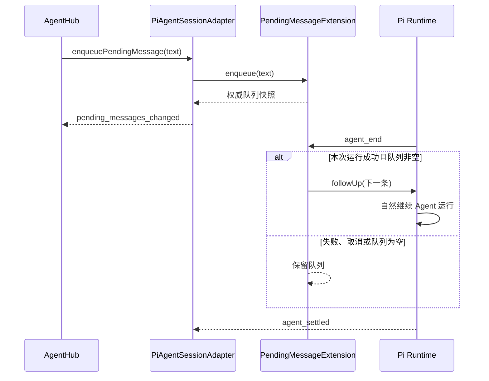

# 会话主链执行线路

本文是会话功能的阅读入口。先看主链，再按具体行为进入对应模块。

## 模块职责

| 模块                                                    | 职责                                                                      | 不负责                       |
| ------------------------------------------------------- | ------------------------------------------------------------------------- | ---------------------------- |
| `apps/backend/src/hub/agent-hub.ts`                     | 本地服务唯一入口；协调配置、会话 Runtime 唯一性、提示准入、生命周期和订阅 | Pi SDK 对象创建、协议序列化  |
| `apps/backend/src/hub/pi-agent-hub-adapter.ts`          | 创建、打开、派生、归档和删除 Pi 持久化会话                                | 多客户端订阅、提示并发控制   |
| `apps/backend/src/hub/pi-agent-session-adapter.ts`      | 把一个 Pi Runtime 投影为后端执行历史、状态和原始事件                      | 产品历史聚合、协议分派       |
| `apps/backend/src/history/product-history-recorder.ts`  | 把 Pi 执行事件录制为一次完整 `AgentRun`                                   | Pi Runtime 创建、页面渲染    |
| `apps/backend/src/history/product-history.ts`           | 管理产品会话、分支、运行、来源引用、revision 和订阅                       | 解释 JSON-RPC、调用 Pi SDK   |
| `apps/backend/src/history/sqlite-history-repository.ts` | 原子持久化完整产品会话聚合                                                | 会话领域规则                 |
| `apps/backend/src/extensions/pending-messages/`         | 管理待处理消息并在成功运行结束后通过 Pi 继续处理                          | 协议分派、客户端队列展示     |
| `apps/backend/src/extensions/auto-session-title/`       | 首轮成功运行结算后生成一次自动标题                                        | 会话事件投影、客户端标题选择 |
| `apps/backend/src/http/rpc-server.ts`                   | 管理 WebSocket 连接、JSON-RPC 分派与会话订阅                              | 会话业务规则                 |
| `apps/web/src/services/session-recovery.ts`             | 连接 JSON-RPC 订阅；用产品快照和后续通知恢复当前会话                      | 解释 Pi 事件                 |
| `apps/web/src/state/chat-session-state.ts`              | 把产品快照、历史变化、草稿和状态事件归并成客户端状态                      | 网络连接、React 页面状态     |
| `apps/web/src/hooks/use-chat-session.ts`                | 将恢复线路和用户命令组合成页面使用的稳定接口                              | Pi 事件细节、消息渲染        |
| `apps/web/src/state/chat-session-selectors.ts`          | 从语义状态选择标题、可编辑消息和工具配对                                  | 修改状态                     |

## 用户发送消息

JSON-RPC 响应只表示提示已被接受。后端以 Pi `agent_settled` 结算产品 `AgentRun`，客户端通过 `session_history_changed` 中的最终运行状态得知完整回复已经结束，不直接消费 Pi 生命周期事件。

## 待处理消息

待处理消息 Extension 拥有稳定 ID、FIFO 队列、逐条调整方向、删除、全部取回和停止协调。会话适配器只转发用户命令并把队列快照投影为会话事件，不注册或解释 `agent_end`。Pi 必须在 `agent_end` handler 返回后看到新的 `followUp` 才会在同一次运行中自然续跑；`agent_settled` 只表示全部排队、重试和压缩已经结束。

## 事件到页面

```mermaid
flowchart LR
  Pi[Pi Runtime 事件] --> Adapter[PiAgentSessionAdapter]
  Adapter --> Recorder[ProductHistoryRecorder]
  Recorder --> History[ProductHistory]
  History --> Store[(SQLite / 内存草稿)]
  Store --> Hub[AgentHub 产品订阅]
  Hub --> RPC[JSON-RPC Gateway]
  RPC --> Recovery[session-recovery]
  Recovery --> State[chat-session-state]
  State --> Selectors[chat-session-selectors]
  Selectors --> Page[ChatWorkspace / ChatTranscript]
```

Pi 原始事件只在后端执行边界内流动。`ProductHistoryRecorder` 将消息、工具运行、重试和上下文压缩映射为产品 timeline；已完成事实先提交 SQLite，再由产品历史事件广播，正在生成的当前片段保存在内存草稿。客户端只归并产品事件并按 `AgentRun` 渲染，不认识 Pi 消息或 `entryId`。

## 会话快照恢复

恢复遵守 ADR-0011，顺序固定：

1. `rpc-server.ts` 先建立 Agent Hub 订阅，期间把新事件暂存。
2. Agent Hub 组合 SQLite 产品历史、活动内存草稿和同一个 Runtime 的会话状态。
3. JSON-RPC 依次发送快照响应、暂存通知和后续实时通知。
4. `session-recovery.ts` 用快照校准页面，再消费增量事件。

客户端断线期间不重放事件日志；已提交 timeline、当前 revision 和服务仍在时的活动草稿由下一份快照恢复。服务重启后，已提交内容保留，未结算运行标记为中断。

## 会话标题

标题功能没有被简化或删除。执行线路如下：

1. `pi-agent-hub-adapter.ts` 显式加载隐藏的内置自动标题 Extension，外部 Extension 仍保持关闭。
2. Extension 在 `agent_end` 记录运行结果，直到 `agent_settled` 才启动后台标题任务。
3. `auto-session-title-extension.ts` 写入一次性尝试标记，选择首条用户消息和首条成功回复，再使用当前会话模型生成并校验中文短标题。
4. Pi 标题事件先提交到产品历史，再通过 JSON-RPC 同步到所有客户端；产品数据库是会话列表标题的权威。
5. `packages/protocol/src/session-title.ts` 统一展示优先级：产品标题、首条用户消息、已有列表标题、“新对话”。
6. 手动标题先写产品历史，再写 Pi `sessionName`；Extension 在模型调用前后检查 Pi 字段，不会覆盖用户操作。
7. 派生会话复用源会话展示标题，并保留“（分叉）”后缀。

## 修改某项行为时

- 改 Pi Runtime 创建或持久化：从 `pi-agent-hub-adapter.ts` 开始。
- 改单会话 Pi 能力：从 `pi-agent-session-adapter.ts` 开始。
- 改跨会话并发、生命周期或订阅：从 `agent-hub.ts` 开始。
- 改断线恢复时序：同时检查 `rpc-server.ts`、`rpc-client.ts`、`session-recovery.ts` 和 ADR-0011。
- 改 Pi 事件到产品 timeline 的映射：从 `history/product-history-recorder.ts` 进入。
- 改产品事件的客户端归并：从 `chat-session-state.ts` 进入，再检查对应状态测试。
- 改页面从状态中读取什么：使用或扩展 `chat-session-selectors.ts`，不要在页面重建领域规则。
- 改待处理消息状态或自动续跑：从 `extensions/pending-messages/` 开始。
- 改标题展示优先级：从 `packages/protocol/src/session-title.ts` 开始。
- 改自动标题生命周期或生成规则：从 `extensions/auto-session-title/` 开始。
