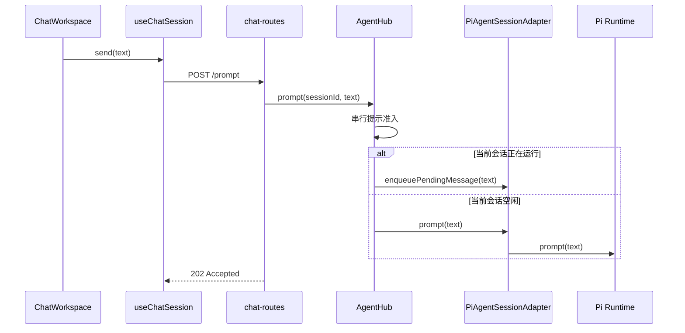
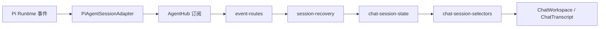

# 会话主链执行线路

本文是会话功能的阅读入口。先看主链，再按具体行为进入对应模块。

## 模块职责

| 模块                                               | 职责                                                                      | 不负责                       |
| -------------------------------------------------- | ------------------------------------------------------------------------- | ---------------------------- |
| `apps/backend/src/hub/agent-hub.ts`                | 本地服务唯一入口；协调配置、会话 Runtime 唯一性、提示准入、生命周期和订阅 | Pi SDK 对象创建、HTTP 序列化 |
| `apps/backend/src/hub/pi-agent-hub-adapter.ts`     | 创建、打开、派生、归档和删除 Pi 持久化会话                                | 多客户端订阅、提示并发控制   |
| `apps/backend/src/hub/pi-agent-session-adapter.ts` | 把一个 Pi Runtime 投影为消息、状态、快照和事件                            | 产品生命周期干预、HTTP 路由  |
| `apps/backend/src/extensions/auto-session-title/`  | 首轮成功运行结算后生成一次自动标题                                        | 会话事件投影、客户端标题选择 |
| `apps/backend/src/http/routes/*.ts`                | 校验 HTTP 输入，把请求交给 Agent Hub，把结果写入响应                      | 会话业务规则                 |
| `apps/web/src/services/session-recovery.ts`        | 连接 SSE；按快照、增量、稳定历史的顺序恢复当前会话                        | 解释 Pi 事件的展示含义       |
| `apps/web/src/state/chat-session-state.ts`         | 把快照、Pi 增量事件和操作结果归并成客户端语义状态                         | 网络连接、React 页面状态     |
| `apps/web/src/hooks/use-chat-session.ts`           | 将恢复线路和用户命令组合成页面使用的稳定接口                              | Pi 事件细节、消息渲染        |
| `apps/web/src/state/chat-session-selectors.ts`     | 从语义状态选择标题、可编辑消息和工具配对                                  | 修改状态                     |

## 用户发送消息

HTTP `202` 只表示提示已被接受。Agent 运行何时结束，以 SSE 中的 Pi `agent_settled` 为准。

## 事件到页面

`PiAgentSessionAdapter` 只把 Pi 事件转换为共享协议事件。消息、工具运行、重试和上下文压缩如何展示，由 `chat-session-state.ts` 集中解释；页面不直接解释原始事件。

## 会话快照恢复

恢复遵守 ADR-0011，顺序固定：

1. `event-routes.ts` 先建立 Agent Hub 订阅，期间把新事件暂存。
2. Agent Hub 从同一个 Runtime 读取权威快照。
3. SSE 依次发送快照、暂存事件和后续实时事件。
4. `session-recovery.ts` 用快照校准页面，再消费增量事件。
5. Agent 结算或成功压缩后，恢复线路读取一次持久化历史，为临时消息补齐稳定条目标识。

客户端断线期间不重放事件日志；可确定的当前状态由下一份快照恢复。

## 会话标题

标题功能没有被简化或删除。执行线路如下：

1. `pi-agent-hub-adapter.ts` 显式加载隐藏的内置自动标题 Extension，外部 Extension 仍保持关闭。
2. Extension 在 `agent_end` 记录运行结果，直到 `agent_settled` 才启动后台标题任务。
3. `auto-session-title-extension.ts` 写入一次性尝试标记，选择首条用户消息和首条成功回复，再使用当前会话模型生成并校验中文短标题。
4. Pi 持久化标题变化，通过 SSE 同步到所有客户端。
5. `packages/protocol/src/session-title.ts` 统一展示优先级：持久化标题、首条用户消息、已有列表标题、“新对话”。
6. 手动标题写入同一个 Pi 持久化字段；Extension 在模型调用前后检查该字段，不会覆盖用户操作。
7. 派生会话复用源会话展示标题，并保留“（分叉）”后缀。

## 修改某项行为时

- 改 Pi Runtime 创建或持久化：从 `pi-agent-hub-adapter.ts` 开始。
- 改单会话 Pi 能力：从 `pi-agent-session-adapter.ts` 开始。
- 改跨会话并发、生命周期或订阅：从 `agent-hub.ts` 开始。
- 改断线恢复时序：同时检查 `event-routes.ts`、`session-recovery.ts` 和 ADR-0011。
- 改事件展示含义：只从 `chat-session-state.ts` 进入，再检查对应状态测试。
- 改页面从状态中读取什么：使用或扩展 `chat-session-selectors.ts`，不要在页面重建领域规则。
- 改标题展示优先级：从 `packages/protocol/src/session-title.ts` 开始。
- 改自动标题生命周期或生成规则：从 `extensions/auto-session-title/` 开始。
